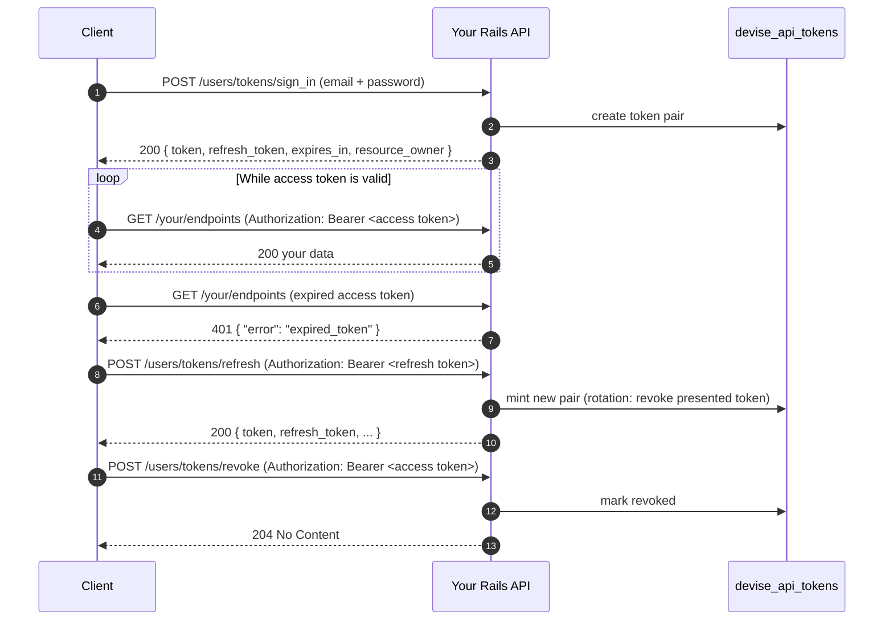
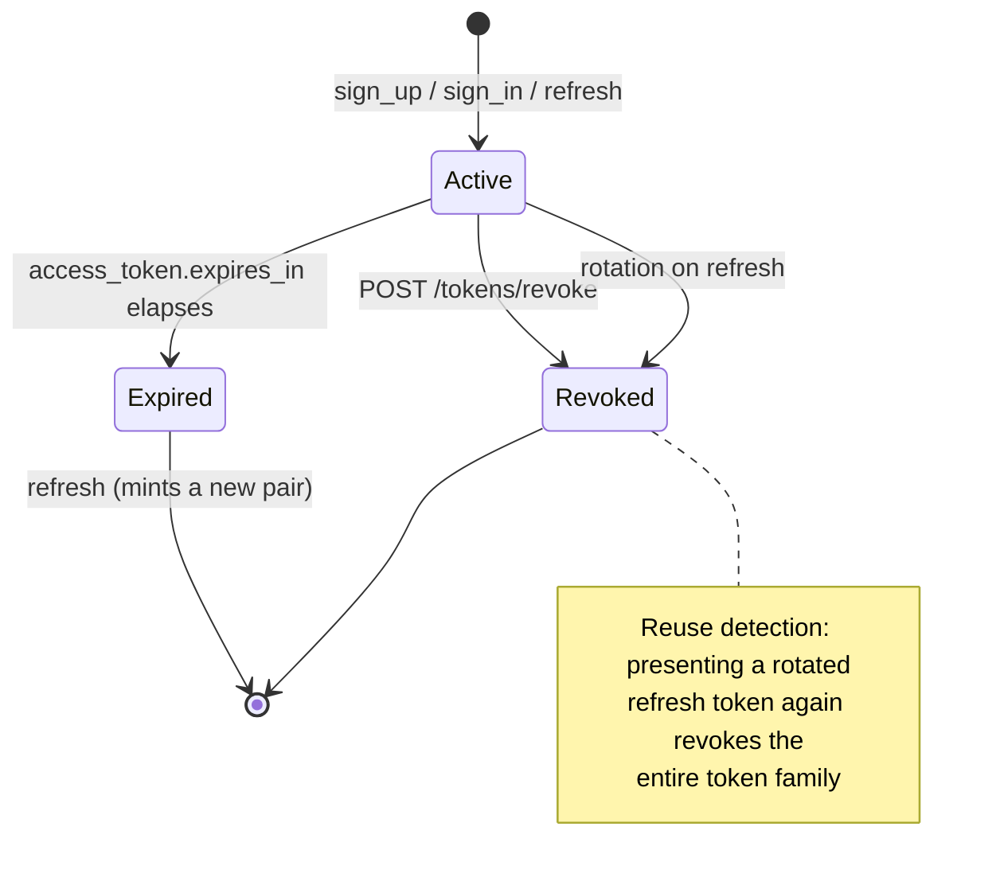

# devise-api

Token-based API authentication for [Devise](https://github.com/heartcombo/devise). Opaque access + refresh tokens, one `devise :api` module, zero Warden strategies to write.

[](https://badge.fury.io/rb/devise-api)


[](https://github.com/rubocop/rubocop)

[](LICENSE)

`devise-api` is a Rails engine that plugs into Devise's own extension mechanism. Add `:api` to your Devise model and you get sign-up, sign-in, token refresh, revocation, and an authenticated info endpoint — plus controller helpers (`authenticate_devise_api_token!`, `current_devise_api_user`) for protecting the rest of your API.

**Highlights**

- 🔑 **Opaque access + refresh tokens** stored in your database — revocable at any time, no JWT invalidation headaches
- 🔁 **Refresh token rotation** with reuse detection (a replayed rotated token revokes the whole token family)
- 🧩 **Plays well with Devise modules** — `lockable`, `confirmable`, `trackable` are detected and honored automatically
- ⚙️ **Fully configurable** — token TTLs and generators, paranoid mode, header/params extraction, per-action callbacks, and swappable base classes for the token model and controller
- 🧱 **Service objects built on dry-monads** — every endpoint delegates to a composable, overridable service
- 📚 **Documented for humans and AI agents** — [`docs/`](docs/README.md) holds contractual architecture, API, and configuration references

## Table of contents

- [How it works](#how-it-works)
- [Requirements](#requirements)
- [Quick start](#quick-start)
- [Endpoints](#endpoints)
- [Protecting your own endpoints](#protecting-your-own-endpoints)
- [Response payloads](#response-payloads)
- [Configuration](#configuration)
- [Security checklist](#security-checklist)
- [Devise module compatibility](#devise-module-compatibility)
- [Customization](#customization)
- [Documentation](#documentation)
- [Development](#development)
- [Contributing](#contributing)
- [License](#license)

## How it works

A client signs in once, then uses a short-lived access token per request and a longer-lived refresh token to get new access tokens without re-sending credentials:



Tokens are opaque random strings (`Devise.friendly_token` by default) persisted in a `devise_api_tokens` table with a polymorphic `resource_owner`, so one table serves any number of Devise scopes (`User`, `Customer`, …). A token is **active** only while it is neither expired nor revoked:



For the full component map and request lifecycle diagrams, see [docs/architecture.md](docs/architecture.md).

## Requirements

| Dependency | Version |
|---|---|
| Ruby | >= 2.7 |
| Rails | >= 6.0 |
| Devise | >= 4.7.2 |

## Quick start

**1. Install the gem**

```bash
bundle add devise-api
```

Or track `main` from your Gemfile:

```ruby
gem 'devise-api', github: 'nejdetkadir/devise-api', branch: 'main'
```

**2. Generate the migration and locales**

```bash
rails generate devise_api:install
rails db:migrate
```

This copies a migration for the `devise_api_tokens` table and the locale file `config/locales/devise_api.en.yml` into your app.

**3. Add the `:api` module to your Devise model**

```ruby
class User < ApplicationRecord
  devise :database_authenticatable,
         :registerable,
         :recoverable,
         :rememberable,
         :validatable,
         :api # <--- add this
end
```

That's it — your existing `devise_for :users` in `config/routes.rb` now draws the token endpoints automatically.

**4. Try it**

```bash
curl -X POST http://localhost:3000/users/tokens/sign_in \
  -H 'Content-Type: application/json' \
  -d '{ "email": "test@example.com", "password": "123456" }'
```

```json
{
  "token": "ACCESS_TOKEN",
  "refresh_token": "REFRESH_TOKEN",
  "expires_in": 3600,
  "token_type": "Bearer",
  "resource_owner": { "id": 1, "email": "test@example.com", "created_at": "...", "updated_at": "..." }
}
```

## Endpoints

Drawn under `/<scope>/tokens` for every Devise scope whose model includes `:api` (examples use `devise_for :users`):

| Verb | Path | Purpose | Auth |
|---|---|---|---|
| `POST` | `/users/tokens/sign_up` | Register and get a token pair | — |
| `POST` | `/users/tokens/sign_in` | Authenticate and get a token pair | — |
| `POST` | `/users/tokens/refresh` | Exchange a refresh token for a new pair | refresh token |
| `POST` | `/users/tokens/revoke` | Revoke the presented token | access token |
| `GET` | `/users/tokens/info` | Current resource owner details | access token |

All tokens — including the refresh token for `/refresh` — travel in the same slot: the `Authorization: Bearer <token>` header and/or an `access_token` param, depending on `authorization.location` (see [Configuration](#configuration)).

```bash
# Sign up
curl -X POST http://localhost:3000/users/tokens/sign_up \
  -H 'Content-Type: application/json' \
  -d '{ "email": "test@example.com", "password": "123456" }'

# Refresh (note: the REFRESH token goes in the Authorization header)
curl -X POST http://localhost:3000/users/tokens/refresh \
  -H 'Authorization: Bearer REFRESH_TOKEN'

# Revoke
curl -X POST http://localhost:3000/users/tokens/revoke \
  -H 'Authorization: Bearer ACCESS_TOKEN'

# Info
curl http://localhost:3000/users/tokens/info \
  -H 'Authorization: Bearer ACCESS_TOKEN'
```

Route paths and the controller are customizable through the standard `devise_for` options:

```ruby
# config/routes.rb
Rails.application.routes.draw do
  devise_for :customers, controllers: { tokens: 'customers/api/tokens' }
end
```

## Protecting your own endpoints

The gem mixes three helpers into **every** controller:

| Helper | Returns |
|---|---|
| `authenticate_devise_api_token!` | Renders a 401 error response unless a valid, active access token is presented |
| `current_devise_api_token` | The active `Devise::Api::Token` (or `nil`) |
| `current_devise_api_user` | The token's resource owner (or `nil`) — works for any scope, despite the name |

```ruby
# app/controllers/api/v1/orders_controller.rb
class Api::V1::OrdersController < ApplicationController
  skip_before_action :verify_authenticity_token, raise: false
  before_action :authenticate_devise_api_token!

  def index
    render json: current_devise_api_user.orders, status: :ok
  end

  def show
    order = current_devise_api_token.resource_owner.orders.find(params[:id])
    render json: order, status: :ok
  end
end
```

## Response payloads

**Success** (`sign_in` 200, `sign_up` 201, `refresh` 200):

```json
{
  "token": "...",
  "refresh_token": "...",
  "expires_in": 3600,
  "token_type": "Bearer",
  "resource_owner": { "id": 1, "email": "...", "created_at": "...", "updated_at": "..." }
}
```

`info` returns just the `resource_owner` object; `revoke` returns `204 No Content`.

**Errors** are consistent JSON with a symbolic type and human-readable descriptions (translated via i18n):

```json
{
  "error": "expired_token",
  "error_description": ["Your token has expired. Please sign in again."]
}
```

Common error types: `invalid_authentication` (401), `invalid_token` (401), `expired_token` (401), `revoked_token` (401), `expired_refresh_token` (401), `invalid_refresh_token` (400), `sign_up_disabled` (400), `resource_owner_create_error` (422). The complete catalog — every type, status, and trigger — lives in [docs/api-reference.md](docs/api-reference.md).

## Configuration

Everything is configured on a single global inside `Devise.setup`. All values shown are the defaults:

```ruby
# config/initializers/devise.rb
Devise.setup do |config|
  config.api.configure do |api|
    # Access token
    api.access_token.expires_in = 1.hour
    api.access_token.expires_in_infinite = ->(_resource_owner) { false }
    api.access_token.generator = ->(_resource_owner) { Devise.friendly_token(60) }

    # Refresh token
    api.refresh_token.enabled = true
    api.refresh_token.expires_in = 1.week
    api.refresh_token.expires_in_infinite = ->(_resource_owner) { false }
    api.refresh_token.generator = ->(_resource_owner) { Devise.friendly_token(60) }
    api.refresh_token.rotation_enabled = false # recommended: true (see Security checklist)

    # Sign up
    api.sign_up.enabled = true
    api.sign_up.extra_fields = [] # e.g. %i[first_name last_name] — writable at sign-up AND echoed in responses

    # Error responses
    api.error_response.verbose_account_state = true # false hides lockable/confirmable details from errors
    api.paranoid = false # true makes unknown accounts indistinguishable from wrong passwords

    # Token extraction
    api.authorization.key = 'Authorization'
    api.authorization.scheme = 'Bearer'
    api.authorization.location = :both # :header, :params, or :both (params win)
    api.authorization.params_key = 'access_token'

    # Base classes (string names, constantized lazily — point at your own subclasses)
    api.base_token_model = 'Devise::Api::Token'
    api.base_controller = '::DeviseController'

    # Lifecycle hooks (all default to no-ops)
    api.before_sign_in  = ->(params, request, resource_class) {}
    api.before_sign_up  = ->(params, request, resource_class) {}
    api.before_refresh  = ->(token, request) {}
    api.before_revoke   = ->(token, request) {}
    api.after_successful_sign_in = ->(resource_owner, token, request) {}
    api.after_successful_sign_up = ->(resource_owner, token, request) {}
    api.after_successful_refresh = ->(resource_owner, token, request) {}
    api.after_successful_revoke  = ->(resource_owner, token, request) {}
  end
end
```

Settings are read at use time (never cached at boot), so changes take effect immediately — handy in tests. The full reference with types, defaults, and exactly which code consumes each setting is in [docs/configuration.md](docs/configuration.md).

## Security checklist

Recommended production settings and guardrails:

- ✅ **Send tokens in the `Authorization` header only.** The default `authorization.location = :both` also accepts tokens as query/body params, and URLs leak into server logs, browser history, and `Referer` headers. Set `api.authorization.location = :header` unless you need params support.
- ✅ **Enable refresh token rotation** (`api.refresh_token.rotation_enabled = true`). Each refresh then revokes the presented refresh token, and replaying a rotated token revokes the entire token family (reuse detection).
- ✅ **Enable paranoid mode** (`api.paranoid = true`) to prevent account enumeration — unknown emails and wrong passwords return the same generic `invalid_authentication` error.
- ✅ **Rate limit the token endpoints.** The gem does not throttle `sign_in`/`sign_up`/`refresh`; put [rack-attack](https://github.com/rack/rack-attack) or an equivalent in front of them. Devise `lockable` only slows per-account brute force.
- ⚠️ **Audit `sign_up.extra_fields`.** Every listed field is mass-assignable at sign-up **and** echoed in every token/info response — never list privileged fields like `:role` or `:admin`.
- ⚠️ **Keep token values out of logs.** The gem adds `access_token`, `refresh_token`, and `previous_refresh_token` to `filter_parameters` and filters the token model's `#inspect`, but raw SQL logging (e.g. debug log level in production) can still print token values.

The full threat-model review is in [docs/analysis/security-review.md](docs/analysis/security-review.md).

## Devise module compatibility

`devise-api` feature-detects the other modules on your model and adapts:

| Module | Behavior |
|---|---|
| `trackable` | `sign_in`/`sign_up` update the tracked fields (sign-in count, IPs, timestamps) |
| `lockable` | Failed sign-ins increment `failed_attempts`; lock state is reported in the error payload (unless paranoid/quiet); a successful sign-in resets the counter |
| `confirmable` | Unconfirmed users can sign **up** (they get tokens plus a `confirmable` notice in the response) but cannot sign **in** until confirmed |

## Customization

### Override the responses

Prepend a decorator module to `TokenResponse` or `ErrorResponse`:

```ruby
# app/lib/devise/api/responses/token_response_decorator.rb
module Devise::Api::Responses::TokenResponseDecorator
  def body
    default_body.merge({ roles: resource_owner.roles })
  end
end
```

```ruby
# config/initializers/devise.rb
require 'devise/api/responses/token_response_decorator'

Devise::Api::Responses::TokenResponse.prepend Devise::Api::Responses::TokenResponseDecorator
```

### Swap the base classes

`base_token_model` and `base_controller` are stored as class *names* and resolved lazily, so you can subclass without load-order problems:

```ruby
# app/models/api_token.rb
class ApiToken < Devise::Api::Token
  belongs_to :organization, optional: true
end
```

```ruby
# config/initializers/devise.rb
Devise.setup do |config|
  config.api.configure do |api|
    api.base_token_model = 'ApiToken'
    api.base_controller = 'Api::BaseController'
  end
end
```

### Hook into the lifecycle

The `before_*` / `after_successful_*` callbacks (see [Configuration](#configuration)) are handy for audit logging, analytics, or sending welcome emails:

```ruby
api.after_successful_sign_up = lambda { |resource_owner, _token, _request|
  WelcomeMailer.with(user: resource_owner).welcome.deliver_later
}
```

`before_*` return values are ignored — raise, or use a `before_action` in a subclassed controller, if you need to halt a request.

### Build your own services

Every endpoint delegates to a service object built on [dry-monads](https://dry-rb.org/gems/dry-monads), [dry-types](https://dry-rb.org/gems/dry-types), and [dry-initializer](https://dry-rb.org/gems/dry-initializer). Inherit from `Devise::Api::BaseService` to compose your own:

```ruby
# app/services/devise/api/tokens_service/v2/create.rb
module Devise::Api::TokensService::V2
  class Create < Devise::Api::BaseService
    option :params, type: Types::Hash, reader: true
    option :resource_class, type: Types::Class, reader: true

    def call
      # ...
      Success(resource)
    end
  end
end
```

```ruby
# app/controllers/api/v1/tokens_controller.rb
def create
  result = Devise::Api::TokensService::V2::Create.new(params: params, resource_class: Customer).call

  if result.success?
    render json: result.success, status: :created
  else
    render json: result.failure, status: :unprocessable_entity
  end
end
```

Service contracts (inputs, success/failure values, composition) are documented in [docs/services.md](docs/services.md), and all supported customization points in [docs/extending.md](docs/extending.md).

## Documentation

The [`docs/`](docs/README.md) directory is the source of truth for how the gem works internally — written for contributors **and** AI coding agents, and kept in sync with the code by convention:

| Document | Contents |
|---|---|
| [architecture.md](docs/architecture.md) | Component map, boot sequence, request lifecycle (with diagrams) |
| [api-reference.md](docs/api-reference.md) | Every endpoint, payload, and the full error catalog |
| [configuration.md](docs/configuration.md) | Every setting: type, default, and where it is consumed |
| [data-model.md](docs/data-model.md) | `devise_api_tokens` schema, token state machine, refresh chains |
| [services.md](docs/services.md) | Service-object contracts and composition |
| [extending.md](docs/extending.md) | Supported customization points |
| [testing.md](docs/testing.md) / [development.md](docs/development.md) | Test layout, dummy app, CI, release process |
| [analysis/](docs/analysis/security-review.md) | Security review and vetted known-issues backlog |

## Development

```bash
bin/setup                # install dependencies
bundle exec rake         # what CI runs: RSpec + RuboCop
bundle exec rake rspec   # tests only
bin/console              # interactive prompt
```

Tests run against the dummy Rails app in `spec/dummy`. To install the gem locally run `bundle exec rake install`; to release, bump `version.rb` and run `bundle exec rake release`.

## Contributing

Bug reports and pull requests are welcome on [GitHub](https://github.com/nejdetkadir/devise-api). Please read [docs/README.md](docs/README.md) for the ground rules (docs are contractual — behavior changes must update the matching document) and check the [known-issues backlog](docs/analysis/known-issues.md) before "fixing" surprising code.

This project is intended to be a safe, welcoming space for collaboration; contributors are expected to follow the [code of conduct](CODE_OF_CONDUCT.md).

## License

The gem is available as open source under the terms of the [MIT License](LICENSE).
