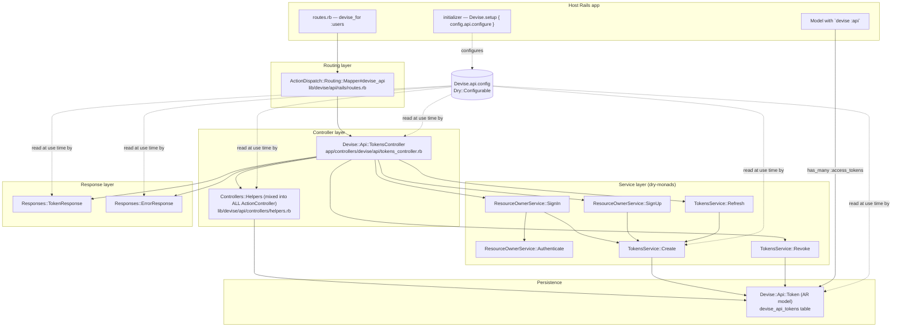
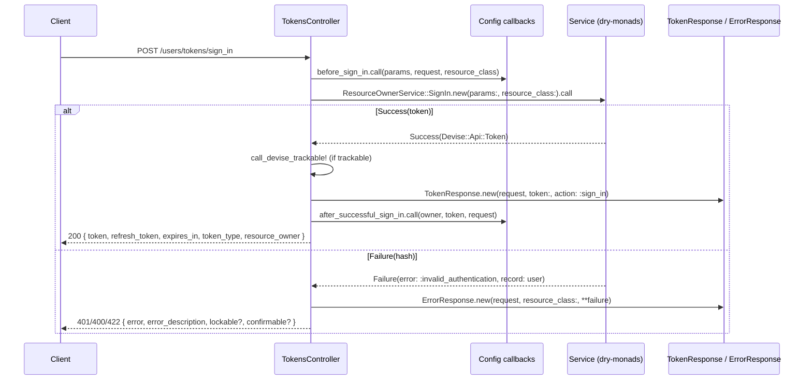

# Architecture

`devise-api` is a Rails engine gem that adds opaque-token API authentication (access + refresh tokens) on top of [Devise](https://github.com/heartcombo/devise). It plugs into Devise's own extension mechanism: it registers an `:api` module via `Devise.add_module`, so host models opt in with `devise :api` and routes appear automatically through `devise_for`.

## Core invariants

These two decisions shape every file in the gem:

1. **One global configuration object.** `Devise.api` (installed in `lib/devise/api.rb` as a `mattr_accessor` holding a `Devise::Api::Configuration` instance) is the single source of truth. Every tunable — token TTLs, generators, callbacks, header names, base classes — is read at *use time* from `Devise.api.config.*`. There is no per-model configuration.
2. **Base classes are strings, resolved lazily.** `base_token_model` (default `'Devise::Api::Token'`) and `base_controller` (default `'::DeviseController'`) are stored as class *names* and `constantize`d at each use site. This lets host apps substitute subclasses without load-order problems. **Library code must never reference `Devise::Api::Token` directly** — always go through `Devise.api.config.base_token_model.constantize`.

## Component map



## Boot / integration sequence

What happens when a host app uses the gem — the "magic" is concentrated in `lib/devise/api.rb`:

1. `require 'devise/api'` (via Bundler) loads configuration, responses, helpers, and generator.
2. `Devise.api = Devise::Api::Configuration.new` installs the global config.
3. `Devise::Models::Api` is defined: an `ActiveSupport::Concern` that adds `has_many :access_tokens` (polymorphic `resource_owner`, `dependent: :destroy`) and the class method `supported_devise_modules` (a `devise_modules.inquiry` used throughout to feature-detect `trackable?` / `lockable?` / `confirmable?`).
4. `Devise.add_module :api, strategy: false, controller: :tokens, route: { api: %i[revoke refresh sign_up sign_in info] }` registers the module with Devise. `strategy: false` means **no Warden strategy is registered** — authentication of API requests is done exclusively by the controller helpers, not by Warden middleware.
5. `ActiveSupport.on_load(:action_controller)` includes `Devise::Api::Controllers::Helpers` into **every** controller, so `authenticate_devise_api_token!`, `current_devise_api_token`, and `current_devise_api_user` are available anywhere.
6. `Devise::Api::Rails::Engine` (an isolated engine) makes `app/controllers` and `app/services` autoloadable.
7. `lib/devise/api/rails/routes.rb` reopens `ActionDispatch::Routing::Mapper` to define `#devise_api`, which Devise's `devise_for` dispatches to (because of the `route:` key in step 4). It draws, under `/<scope>/tokens` (path segment and controller both overridable):
   - `POST sign_up`, `POST sign_in`, `POST refresh`, `POST revoke`, `GET info`

## Request lifecycle

Every `TokensController` action follows the same template — **callback → service → response**:



Key details:

- The controller inherits from `Devise.api.config.base_controller.constantize` (default `::DeviseController`), so Devise's `resource_class` (derived from the route scope, e.g. `devise_for :users` → `User`) is available for free. CSRF verification is skipped; `wrap_parameters false`.
- Services return `Success(token)` or `Failure(hash)` where the hash is `{ error: <symbol>, record: <model or nil> }` — splatted directly into `ErrorResponse.new`. The error symbol must exist in `ErrorResponse::ERROR_TYPES` and have a locale entry.
- Only `info` runs `authenticate_devise_api_token!`. `revoke` and `refresh` look up the token themselves and respond based on what they find (`revoke` with an unknown token still returns `204`).
- `refresh` looks tokens up **by `refresh_token` column**, everything else by `access_token` column — same extraction logic (`find_devise_api_token`), different lookup.

## Token extraction

`Controllers::Helpers#find_devise_api_token` honors `Devise.api.config.authorization.location`:

- `:header` — `request.headers['Authorization']`, stripping the `'Bearer '` scheme prefix (both header name and scheme configurable)
- `:params` — `params['access_token']` (key configurable)
- `:both` (default) — params first, then header

## Directory layout (engine-loaded vs require-loaded)

```
app/                                  # autoloaded via the engine
  controllers/devise/api/tokens_controller.rb
  services/devise/api/                # BaseService + 2 service namespaces
lib/devise/api.rb                     # entry point: module registration, global config
lib/devise/api/
  configuration.rb                    # Dry::Configurable settings tree
  token.rb                            # ActiveRecord model (required at load, NOT autoloaded)
  controllers/helpers.rb              # mixed into ActionController
  responses/{token,error}_response.rb # plain Ruby response builders
  rails/{engine,routes}.rb
  generators/install_generator.rb     # rails g devise_api:install
  generators/templates/migration.rb.erb
config/locales/en.yml                 # all user-facing strings (devise.api.error_response.*)
spec/dummy/                           # full Rails 8 host app used by the test suite
```

## Dependency notes

- **dry-rb stack** (`dry-configurable`, `dry-initializer`, `dry-monads`, `dry-types`): configuration + service objects. `BaseService` defines the shared `Types` module (`include Dry.Types()`).
- **devise** `>= 4.7.2`: model registration, `find_for_authentication`, `valid_password?`, `friendly_token`, lockable/confirmable/trackable integration.
- **rails** `>= 6.0`, Ruby `>= 2.7`.
