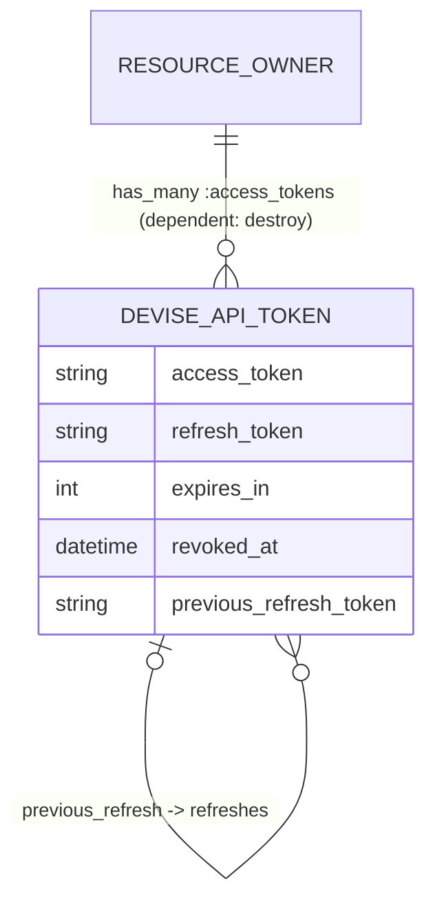

# Data Model

One table, one model: `Devise::Api::Token` (`lib/devise/api/token.rb`) backed by `devise_api_tokens`. The resource owner (User, Customer, …) is polymorphic, so multiple Devise models share the table.

## Schema

From the generator template (`lib/devise/api/generators/templates/migration.rb.erb`); primary/foreign key types follow the host app's generator config (UUID-safe):

| Column | Type | Null | Index | Notes |
|---|---|---|---|---|
| `resource_owner_type` / `resource_owner_id` | string / fk | no | composite | polymorphic owner |
| `access_token` | string | no | yes, **unique** | opaque token, stored **in plaintext** |
| `refresh_token` | string | yes | yes, **unique** | `nil` when refresh disabled |
| `expires_in` | integer | no | — | access-token TTL in seconds, snapshotted at creation |
| `revoked_at` | datetime | yes | — | non-nil ⇒ revoked |
| `previous_refresh_token` | string | yes | yes | links a token to the refresh token it was minted from |
| `created_at` / `updated_at` | datetime | no | — | expiry math is based on `created_at` |

Uniqueness is enforced in three layers: unique DB indexes on `access_token`/`refresh_token` (the backstop), ActiveRecord uniqueness validations, and generate-and-retry loops (`generate_uniq_access_token` / `generate_uniq_refresh_token`). If a concurrent insert still hits the index, `TokensService::Create` rescues `ActiveRecord::RecordNotUnique` and retries with a fresh token (up to 3 attempts). Installs created before the unique indexes shipped should add them via migration (see CHANGELOG).

## Entity relationships



The self-reference is keyed on token *strings*, not ids: `belongs_to :previous_refresh` joins `previous_refresh_token → refresh_token`; `has_many :refreshes` is the inverse. A refresh chain is therefore walkable in both directions.

## Token lifecycle

```mermaid
stateDiagram-v2
    [*] --> active : sign_in / sign_up / refresh (TokensService::Create)
    active --> expired : now > created_at + expires_in
    active --> revoked : revoke (revoked_at set)
    expired --> refreshable : refresh_token still valid
    note right of refreshable
        refresh mints a NEW row with
        previous_refresh_token = old refresh_token.
        Default: the old row is NOT revoked or deleted.
        With rotation_enabled: the old row is revoked.
    end note
    refreshable --> [*]
```

Predicates on `Token`:

- `expired?` — `Time.current > created_at + expires_in.seconds`, unless `access_token.expires_in_infinite.(owner)`. The per-row `expires_in` snapshot means config changes only affect *new* tokens.
- `refresh_token_expired?` — `Time.current > created_at + Devise.api.config.refresh_token.expires_in.seconds`, unless infinite. **Not** snapshotted — reads current config, so changing `refresh_token.expires_in` retroactively re-times existing tokens.
- `revoked?` — `revoked_at.present?`. `active?` = not expired and not revoked.

Mutators: `revoke!` (stamps `revoked_at`, idempotent) and `revoke_family!` (walks to the chain root via `previous_refresh`, then revokes the root and every descendant via `refreshes` — used by refresh-token reuse detection).

The model also filters `access_token`/`refresh_token`/`previous_refresh_token` from `#inspect` via `filter_attributes`, and the engine adds the same keys to the host app's `filter_parameters` (request-log redaction). Raw SQL logging can still print token values.

## Refresh semantics (important)

`TokensService::Refresh`:

1. Controller finds the row by `refresh_token` column; rejects unknown (`invalid_refresh_token`, 400) or revoked (`revoked_token`, 401) tokens.
2. With `refresh_token.rotation_enabled`, a presented token that is revoked **or already has `refreshes`** is treated as reuse: the whole family is revoked (`revoke_family!`) and `revoked_token` is returned.
3. Service rejects if `refresh_token_expired?` (`expired_refresh_token`).
4. Otherwise mints a **new** token row (`previous_refresh_token` = the presented refresh token) and returns it. With rotation enabled, the presented token is revoked in the same transaction.
5. **Without rotation (the default)** the old row keeps its state: its access token stays usable until its own expiry, and its refresh token **can be presented again** until the refresh-token TTL passes — see [analysis/security-review.md](analysis/security-review.md) (SEC-2, resolved via the opt-in flag).

Revoking (`TokensService::Revoke`) only stamps `revoked_at` on the *presented access token's row* — not the whole chain, and not other sessions.

## Cleanup

Nothing prunes dead rows. Expired/revoked tokens accumulate until the resource owner is destroyed (`dependent: :destroy`). Host apps that care should add their own sweep job (candidate future feature).
