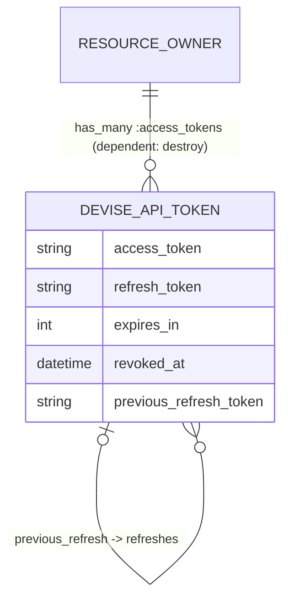

# Data Model

One table, one model: `Devise::Api::Token` (`lib/devise/api/token.rb`) backed by `devise_api_tokens`. The resource owner (User, Customer, …) is polymorphic, so multiple Devise models share the table.

## Schema

From the generator template (`lib/devise/api/generators/templates/migration.rb.erb`); primary/foreign key types follow the host app's generator config (UUID-safe):

| Column | Type | Null | Index | Notes |
|---|---|---|---|---|
| `resource_owner_type` / `resource_owner_id` | string / fk | no | composite | polymorphic owner |
| `access_token` | string | no | yes (⚠ not unique) | opaque token, stored **in plaintext** |
| `refresh_token` | string | yes | yes (⚠ not unique) | `nil` when refresh disabled |
| `expires_in` | integer | no | — | access-token TTL in seconds, snapshotted at creation |
| `revoked_at` | datetime | yes | — | non-nil ⇒ revoked |
| `previous_refresh_token` | string | yes | yes | links a token to the refresh token it was minted from |
| `created_at` / `updated_at` | datetime | no | — | expiry math is based on `created_at` |

Uniqueness is enforced only by ActiveRecord validations + generate-and-retry loops (`generate_uniq_access_token` / `generate_uniq_refresh_token`), **not** by unique DB indexes — see [analysis/known-issues.md](analysis/known-issues.md).

## Entity relationships



The self-reference is keyed on token *strings*, not ids: `belongs_to :previous_refresh` joins `previous_refresh_token → refresh_token`; `has_many :refreshes` is the inverse. A refresh chain is therefore walkable in both directions.

## Token lifecycle

```mermaid
stateDiagram-v2
    [*] --> active : sign_in / sign_up / refresh (TokensService::Create)
    active --> expired : now > created_at + expires_in
    active --> revoked : revoke (revoked_at set)
    expired --> refreshable : refresh_token still valid
    note right of refreshable
        refresh mints a NEW row with
        previous_refresh_token = old refresh_token.
        The old row is NOT revoked or deleted.
    end note
    refreshable --> [*]
```

Predicates on `Token`:

- `expired?` — `Time.now.utc > created_at + expires_in.seconds`, unless `access_token.expires_in_infinite.(owner)`. The per-row `expires_in` snapshot means config changes only affect *new* tokens.
- `refresh_token_expired?` — `Time.now.utc > created_at + Devise.api.config.refresh_token.expires_in.seconds`, unless infinite. **Not** snapshotted — reads current config, so changing `refresh_token.expires_in` retroactively re-times existing tokens.
- `revoked?` — `revoked_at.present?`. `active?` = not expired and not revoked.

## Refresh semantics (important)

`TokensService::Refresh`:

1. Controller finds the row by `refresh_token` column; rejects unknown (`invalid_token`) or revoked (`revoked_token`) tokens.
2. Service rejects if `refresh_token_expired?` (`expired_refresh_token`).
3. Otherwise mints a **new** token row (`previous_refresh_token` = the presented refresh token) and returns it.
4. The old row keeps its state: its access token stays usable until its own expiry, and its refresh token **can be presented again** until the refresh-token TTL passes. There is no rotation/invalidations-on-reuse — a deliberate current behavior with security implications, tracked in [analysis/security-review.md](analysis/security-review.md).

Revoking (`TokensService::Revoke`) only stamps `revoked_at` on the *presented access token's row* — not the whole chain, and not other sessions.

## Cleanup

Nothing prunes dead rows. Expired/revoked tokens accumulate until the resource owner is destroyed (`dependent: :destroy`). Host apps that care should add their own sweep job (candidate future feature).
