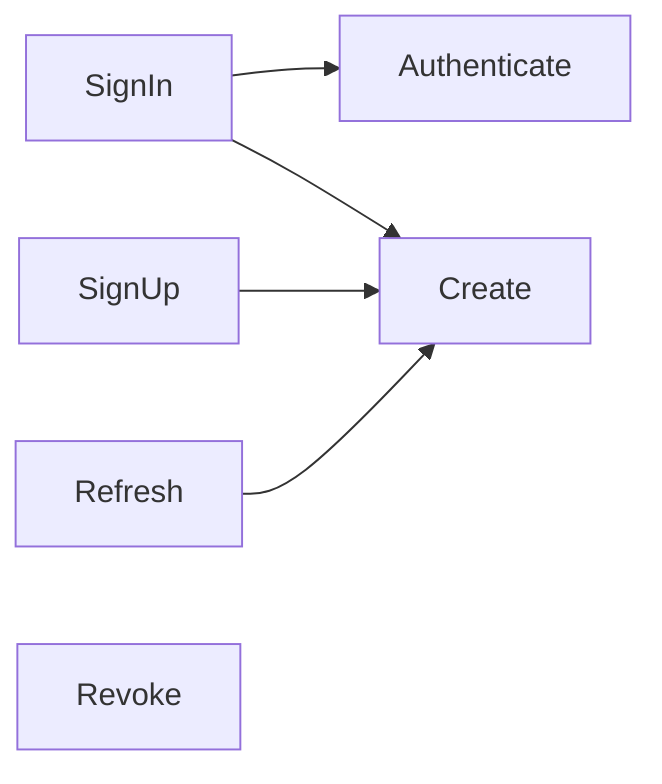

# Service Layer Contracts

All services live in `app/services/devise/api/` and inherit `Devise::Api::BaseService`, which wires:

- **dry-initializer** — declare inputs with `option :name, type: Types::X`
- **dry-monads** — `Success` / `Failure` returns, do-notation (`yield another_service_call` unwraps a `Success` or short-circuits the whole `call` with the inner `Failure`)
- a shared `Types` module (`include Dry.Types()`)

## Universal contract

```
service = SomeService.new(**options).call
service.success? → service.success  # a Devise::Api::Token (or resource owner for Authenticate)
service.failure? → service.failure  # { error: Symbol, record: <AR model or nil> }
```

The failure hash is splatted straight into `ErrorResponse.new(request, resource_class:, **failure)`, so:
- `error:` **must** be a symbol from `ErrorResponse::ERROR_TYPES` with a locale entry (see [api-reference.md](api-reference.md)).
- `record:` (optional) supplies validation messages and lockable/confirmable context.

## Composition graph



## ResourceOwnerService

### `Authenticate`
- **Inputs:** `params: Types::Hash`, `resource_class: Types::Class`
- **Logic:** `find_for_authentication(params.slice(*authentication_keys))` → `valid_for_authentication? { valid_password? }` (increments `failed_attempts` for lockable) → `active_for_authentication?` (fails for locked/unconfirmed).
- **Success:** the resource owner. **Failures:** no record → `:invalid_email` when `:email` is an authentication key, `:invalid_login` otherwise, or `:invalid_authentication` when `paranoid` is enabled (all with `record: nil`); wrong password / inactive account → `:invalid_authentication` (record attached).

### `SignIn`
- **Inputs:** `params`, `resource_class`
- **Logic:** `Authenticate` → `TokensService::Create`; resets lockable failed attempts on success.
- **Success:** the new `Devise::Api::Token`. **Failures:** propagated from children.

### `SignUp`
- **Inputs:** `params`, `resource_class`
- **Logic:** inside a DB transaction: `resource_class.new(params).save` → `TokensService::Create`.
- **Success:** the new token. **Failures:** `:resource_owner_create_error` (record attached) or propagated. The transaction works because do-notation's `yield` raises `Dry::Monads::Do::Halt` on a `Failure` — the exception unwinds through the `transaction` block (rolling back the already-saved user if token creation fails) before the `Do` wrapper converts it back into the `Failure` return value.

### `TokensService`

### `Create`
- **Inputs:** `resource_owner` (untyped), `previous_refresh_token: String | Nil = nil`
- **Logic:** guards `resource_owner.respond_to?(:access_tokens)` → builds row with generated unique access/refresh tokens, `expires_in` snapshot from config, `previous_refresh_token` passthrough. Rescues `ActiveRecord::RecordNotUnique` from the unique token indexes and retries with freshly generated tokens (`MAX_TOKEN_GENERATION_ATTEMPTS = 3`), then re-raises.
- **Success:** the token. **Failures:** `:invalid_resource_owner`, `:devise_api_token_create_error`.

### `Refresh`
- **Inputs:** `devise_api_token` (typed `Types.Instance(<base_token_model>)` — resolved at class load), `resource_owner` (defaults to the token's owner)
- **Logic:** reject if `refresh_token_expired?` → `Create` with `previous_refresh_token` set. With `refresh_token.rotation_enabled`, the new token is minted and the presented token revoked in one transaction (a `Create` failure rolls back and leaves the presented token untouched); otherwise the old token is **not** revoked.
- **Failures:** `:expired_refresh_token` or propagated.

### `Revoke`
- **Inputs:** `devise_api_token` (optional — may be `nil`)
- **Logic:** blank token → `Success(nil)`; already revoked/expired → `Success(token)` (idempotent); else stamp `revoked_at = Time.current`.
- **Failures:** `:devise_api_token_revoke_error`.

## Conventions for new services

1. Inherit `Devise::Api::BaseService`; declare inputs with `option` + `Types`.
2. Return `Success(value)` / `Failure(error: :symbol, record: model_or_nil)` — never raise for expected outcomes.
3. New error symbols require: `ERROR_TYPES` entry, status mapping in `ErrorResponse#status`, locale string, api-reference row.
4. Compose via do-notation (`yield`), not manual `if service.success?` nesting.
5. Cover behavior with both request specs and service unit specs asserting the monad contract (see `spec/services/**`).
